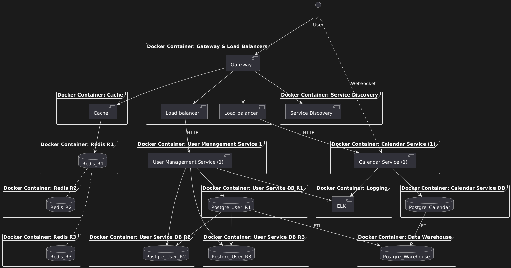

# Shared Calendar for Families, Couples, or Friends

## Overview

This project aims to develop a **Shared Calendar** application designed for families, couples, or groups of friends, providing a streamlined experience for scheduling and managing events together. The application will allow users to create events, share schedules, send reminders, and maintain communication within the group. To ensure scalability and modularity, the application will be designed using a **microservices architecture**.

### 1. Application Suitability

Before implementing microservices, it's essential to determine if the application fits this architecture style. Microservices are suitable for complex applications where different components can function independently. For a shared calendar app, key reasons for using microservices include:

- **Scalability**: Ability to scale calendar service based on traffic.
- **Independence**: Each service (e.g., user management, calendar management, notifications) can be developed, tested, and deployed independently.
- **Distributed Teams**: Teams can work on different services in parallel.

#### Real-World Examples:

- **Google Calendar**: Scales and maintains modular components for calendar events, notifications, and shared access.

### 2. Service Boundaries

In the Shared Calendar App, the following services are developed:

- **Authentication Service**: Responsible for user management, including registration, login, and session handling.
- **Calendar Service**: Handles the creation, editing, and real-time sharing of events within rooms (groups). Each room is essentially a socket namespace or channel, where users can collaborate and update shared calendars.
- **Gateway Component**: Acts as an entry point for all client requests, routing them to the appropriate services.

#### Architecture Diagram:

**Version 1**


**Version 2**


### 3. Technology Stack, Communication Patterns and Additional Implementations

Each service requires a dedicated technology stack and well-defined communication patterns for inter-service communication:

**Technology Stack**:

- **Authentication Service**:
  - Language: Python
  - Framework: Flask (for REST API routing)
  - Authentication: JSON Web Tokens (JWT) for secure token-based authentication.
  - Database: PostgreSQL
- **Calendar Service**:
  - Language: Python
  - Framework: Python’s socket library for real-time communication.
  - Rooms: Users can join specific socket rooms (e.g., family groups) to manage events.
  - Database: PostgreSQL
- **Gateway Component**:
  - Language: Go
  - Framework: Gorilla Mux for routing requests
  - Responsibilities: Routing incoming requests to the appropriate service, handling authentication, and load balancing.
  - Database: Redis

**Communication Patterns**:

- **REST API (for Authentication Service)**:
  - The Authentication Service will expose RESTful endpoints to allow users to register, login, and authenticate.
- **Sockets (for Calendar Service)**:
  - Real-time communication using WebSockets, where users can join rooms and receive live updates about event changes in their respective groups.
- **Token-based Communication**:
  - The Authentication Service will provide JWT tokens that are passed to the Calendar Service for secure communication and validation within socket rooms.
- **gRPC (for Gateway Communication)**:
  - The Gateway Component will handle incoming requests, verify JWT tokens, and route requests to the appropriate service (Authentication or Calendar).

**High Availability Strategies**:

- **Load Balancing**: The Gateway Component distributes incoming requests across multiple instances of each service to balance the load.
- **Redundant Service Instances**: Each service is deployed in multiple instances to ensure redundancy.
- **Circuit Breaker Mechanism**: Implemented within the Gateway Component to handle unstable service conditions.
- **Caching with Redis**: Frequently requested data, such as authentication tokens and user session data, is cached.
- **Database Replication**: Each PostgreSQL database is configured with primary-replica replication.

**Monitoring and Logging**:

To maintain system reliability and provide real-time visibility into the application’s performance, **Prometheus** and **Grafana** is utilized for monitoring, logging, and visualization.

**Saga Pattern**:

To maintain consistency across multiple databases, the application uses a **Saga Pattern** for operations that involve multiple services or databases.

The `create_event` endpoint in the Calendar Service initiates a transaction across multiple databases (e.g., updating the event data in the Calendar Service’s PostgreSQL database and adding a participant record in the Authentication Service’s database).

#### Benefits:

- **Consistency**: Ensures both services either succeed together or fail, maintaining data integrity.
- **Isolation**: Allows each database to function independently but coordinate with others during critical operations.

### 4. Design Data Management

Each service will have its own database or data management strategy to ensure independence.

#### Endpoints for Authentication Service:

- **POST /user/register**: Registers a new user.

  - **Rate Limit**: 5 requests per minute.
  - **Request Body**:
    ```json
    {
      "username": "string",
      "password": "string"
    }
    ```
  - **Response Codes**:
    - **201 Created**: User was successfully registered.
    - **400 Bad Request**: Invalid input (e.g., missing username or password).
    - **409 Conflict**: Username already exists.

- **POST /user/login**: Logs in a user and provides a JWT token upon successful authentication.

  - **Rate Limit**: 5 requests per minute.
  - **Request Body**:
    ```json
    {
      "username": "string",
      "password": "string"
    }
    ```
  - **Response Codes**:
    - **200 OK**: Login successful, returns a JWT token.
      - **Response Body**:
        ```json
        {
          "message": "Logged in successfully!",
          "token": "string",
          "username": "string"
        }
        ```
    - **401 Unauthorized**: Invalid credentials (e.g., incorrect username or password).
    - **500 Internal Server Error**: An unexpected error occurred during login.

- **GET /user/status**: Checks if the service and database are operational.

  - **Response Codes**:
    - **200 OK**: Service and database are up and running.
      - **Response Body**:
        ```json
        {
          "message": "Service and database are up and running"
        }
        ```

#### Real-Time Calendar Data (Python + Sockets):

Users will interact with the calendar service via socket connections. Here’s how rooms and events work:

Here's the updated documentation for each endpoint and socket event:

### HTTP Endpoints

- **GET /calendar/status**: Checks if the calendar service and database are operational.

  - **Response Codes**:
    - **200 OK**: Service and database are up and running.
      - **Response Body**:
        ```json
        {
          "message": "Service and database are up and running"
        }
        ```

- **POST /calendar/create_calendar**: Creates a new calendar.

  - **Rate Limit**: 5 requests per minute.
  - **Request Body**:
    ```json
    {
      "calendar_name": "string",
      "calendar_password": "string"
    }
    ```
  - **Response Codes**:
    - **201 Created**: Calendar successfully created.
    - **409 Conflict**: Calendar already exists.

- **GET /calendar/get_events**: Retrieves all events from the calendar the user has joined.
  - **Rate Limit**: 5 requests per minute.
  - **Response Codes**:
    - **200 OK**: Events retrieved successfully.
      - **Response Body**:
        ```json
        {
          "events": [
            {
              "event_name": "string",
              "event_start": "datetime",
              "event_end": "datetime",
              "created_by": "string"
            }
          ]
        }
        ```
    - **404 Not Found**: No events found or user is not in a calendar.

### WebSocket Events

- **connect**: Establishes a connection to the socket.

  - **Description**: Emits a message when a user connects to the socket.
  - **Response**: Emits a message confirming the user’s connection.

- **disconnect**: Disconnects from the socket.

  - **Description**: Emits a message when a user disconnects from the socket.
  - **Response**: Emits a message confirming the user’s disconnection.

- **message**: Broadcasts a message to all users.

  - **Payload**:
    ```json
    {
      "message": "string"
    }
    ```
  - **Response**: Broadcasts the message to all connected users.

- **join_calendar**: Joins a specified calendar room.

  - **Payload**:
    ```json
    {
      "calendar_name": "string"
    }
    ```
  - **Response**:
    - **Success**: Emits a message confirming the user joined the calendar.
    - **Failure**: Emits a message if the calendar does not exist or the user is already in the calendar.

- **leave_calendar**: Leaves a specified calendar room.

  - **Payload**:
    ```json
    {
      "calendar_name": "string"
    }
    ```
  - **Response**:
    - **Success**: Emits a message confirming the user left the calendar.
    - **Failure**: Emits a message if the calendar does not exist or the user was not in the calendar.

- **create_event**: Creates a new event in the specified calendar.
  - **Payload**:
    ```json
    {
      "event_name": "string",
      "event_start": "datetime",
      "event_end": "datetime",
      "calendar_name": "string"
    }
    ```
  - **Response**:
    - **Success**: Emits a message to all users in the calendar room about the new event.
    - **Failure**: Returns a message if the calendar does not exist or if the user is not a member of the calendar.

### 5. Set Up Deployment and Scaling

To manage and deploy our microservices efficiently, we will employ containerization tools:

- **Docker**: Each service will run in its own Docker container, providing isolation and simplifying deployment.

- **Scaling**: The system will use horizontal scaling multiplying the instances of the services using Docker Compose.

### 6. Running and Deploying the Project

1. Clone the repository

```bash
git clone https://github.com/SexomQ/PAD
cd PAD
```

2. Set up virtual environments for Python services and install dependencies:

```bash
cd user-management-service
python3 -m venv venv
source venv/bin/activate
pip install -r requirements.txt
```

```bash
cd ../calendar-service
python3 -m venv venv
source venv/bin/activate
pip install -r requirements.txt
```

3. Set up the dependences for Go:

```bash
cd ../api-gateway
go mod download
```

4. Run the Docker compose

```bash
cd ..
docker compose up --build
```

### 7. Postman Collection

An exported collection of all API endpoints is provided in [postman_collection.json](utils/Shared_Calendar.postman_collection.json).

**To test:**
Open Postman and import the postman_collection.json.
