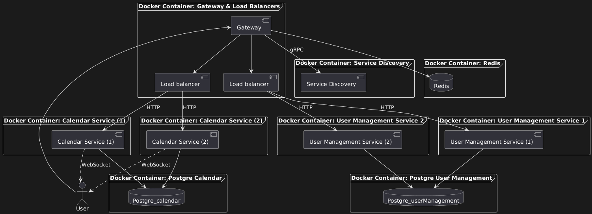

# Shared Calendar for Families, Couples, or Friends

## Overview

This project aims to develop a **Shared Calendar** application designed for families, couples, or groups of friends, providing a streamlined experience for scheduling and managing events together. The application will allow users to create events, share schedules, send reminders, and maintain communication within the group. To ensure scalability and modularity, the application will be designed using a **microservices architecture**.

### 1. Application Suitability

Before implementing microservices, it's essential to determine if the application fits this architecture style. Microservices are suitable for complex applications where different components can function independently. For a shared calendar app, key reasons for using microservices include:

- **Scalability**: Ability to scale calendar service based on traffic.
- **Independence**: Each service (e.g., user management, calendar management, notifications) can be developed, tested, and deployed independently.
- **Distributed Teams**: Teams can work on different services in parallel.

#### Real-World Examples:

- **Google Calendar**: Scales and maintains modular components for calendar events, notifications, and shared access.

### 2. Service Boundaries

In the Shared Calendar App, the following services are developed:

- **Authentication Service**: Responsible for user management, including registration, login, and session handling.
- **Calendar Service**: Handles the creation, editing, and real-time sharing of events within rooms (groups). Each room is essentially a socket namespace or channel, where users can collaborate and update shared calendars.
- **Gateway Component**: Acts as an entry point for all client requests, routing them to the appropriate services.

#### Architecture Diagram:



### 3. Technology Stack and Communication Patterns

Each service requires a dedicated technology stack and well-defined communication patterns for inter-service communication:

**Technology Stack**:

- **Authentication Service**:
  - Language: Python
  - Framework: Flask (for REST API routing)
  - Authentication: JSON Web Tokens (JWT) for secure token-based authentication.
  - Database: PostgreSQL
- **Calendar Service**:
  - Language: Python
  - Framework: Python’s socket library for real-time communication.
  - Rooms: Users can join specific socket rooms (e.g., family groups) to manage events.
  - Database: PostgreSQL
- **Gateway Component**:
  - Language: Go
  - Framework: Gorilla Mux for routing requests
  - Responsibilities: Routing incoming requests to the appropriate service, handling authentication, and load balancing.
  - Database: Redis

**Communication Patterns**:

- **REST API (for Authentication Service)**:
  - The Authentication Service will expose RESTful endpoints to allow users to register, login, and authenticate.
- **Sockets (for Calendar Service)**:
  - Real-time communication using WebSockets, where users can join rooms and receive live updates about event changes in their respective groups.
- **Token-based Communication**:
  - The Authentication Service will provide JWT tokens that are passed to the Calendar Service for secure communication and validation within socket rooms.
- **gRPC (for Gateway Communication)**:
  - The Gateway Component will handle incoming requests, verify JWT tokens, and route requests to the appropriate service (Authentication or Calendar).

### 4. Design Data Management

Each service will have its own database or data management strategy to ensure independence.

#### Endpoints for Authentication Service:

- **POST /users/register**: Registers a new user.

  - Request Body:
    ```json
    {
      "username": "string",
      "password": "string"
    }
    ```
  - Response Codes:
    - **201 Created**: User was successfully registered.
    - **400 Bad Request**: Invalid input (e.g., missing username or password).
    - **409 Conflict**: Username already exists.

- **POST /users/login**: Logs in an existing user.

  - Request Body:
    ```json
    {
      "username": "string",
      "password": "string"
    }
    ```
  - Response:
    ```json
    {
      "token": "JWT_token"
    }
    ```
  - Response Codes:
    - **200 OK**: Successfully authenticated and token returned.
    - **401 Unauthorized**: Invalid username or password.
    - **400 Bad Request**: Malformed request (e.g., missing fields).

- **GET /users/me**: Fetches the details of the logged-in user (using JWT).
  - Response:
    ```json
    {
      "username": "string",
      "userId": "string"
    }
    ```
  - Response Codes:
    - **200 OK**: User information successfully retrieved.
    - **401 Unauthorized**: JWT token is missing or invalid.
    - **403 Forbidden**: User does not have permission to access the requested resource.

#### Real-Time Calendar Data (Python + Sockets):

Users will interact with the calendar service via socket connections. Here’s how rooms and events work:

1. **Create Room**: When a group (family or friends) starts using the calendar, a new room (socket namespace) is created. Each room can have multiple users.
   - Example: Room for "Family A" created.
2. **Join Room**: Users join a room to collaborate on events.
   - Example: A user joins "Family A" room via a socket connection.
3. **Create/Update Events**: Events are created or updated within a room and broadcasted to all users in that room.
   - Example Event Data:
   ```json
   {
     "eventId": "string",
     "eventTitle": "string",
     "startTime": "datetime",
     "endTime": "datetime",
     "participants": ["user1", "user2"]
   }
   ```

#### Calendar Service Flow:

- **Connect to Room**:

  - Event: `join_room`
  - Payload:
    ```json
    {
      "roomId": "family_room",
      "token": "JWT_token"
    }
    ```
  - Response Codes:
    - **200 OK**: Successfully connected to the room.
    - **401 Unauthorized**: Invalid or missing JWT token.
    - **404 Not Found**: Room does not exist.

- **Create Event**:

  - Event: `create_event`
  - Payload:
    ```json
    {
      "roomId": "family_room",
      "eventTitle": "Dinner",
      "startTime": "datetime",
      "endTime": "datetime"
    }
    ```
  - Response Codes:
    - **201 Created**: Event successfully created and broadcasted.
    - **400 Bad Request**: Invalid event data (e.g., missing or invalid fields).
    - **403 Forbidden**: User not allowed to create events in this room.

- **Broadcast Update**:
  - Event: `update_event`
  - Broadcasted to all room members when an event is created or updated.
  - Response Codes:
    - **200 OK**: Event update successfully broadcasted.
    - **400 Bad Request**: Invalid event data.
    - **404 Not Found**: Event does not exist.

### 5. Set Up Deployment and Scaling

To manage and deploy our microservices efficiently, we will employ containerization and orchestration tools:

- **Docker**: Each service will run in its own Docker container, providing isolation and simplifying deployment.

- **Scaling**: The system will use horizontal scaling multiplying the instances of the services.
